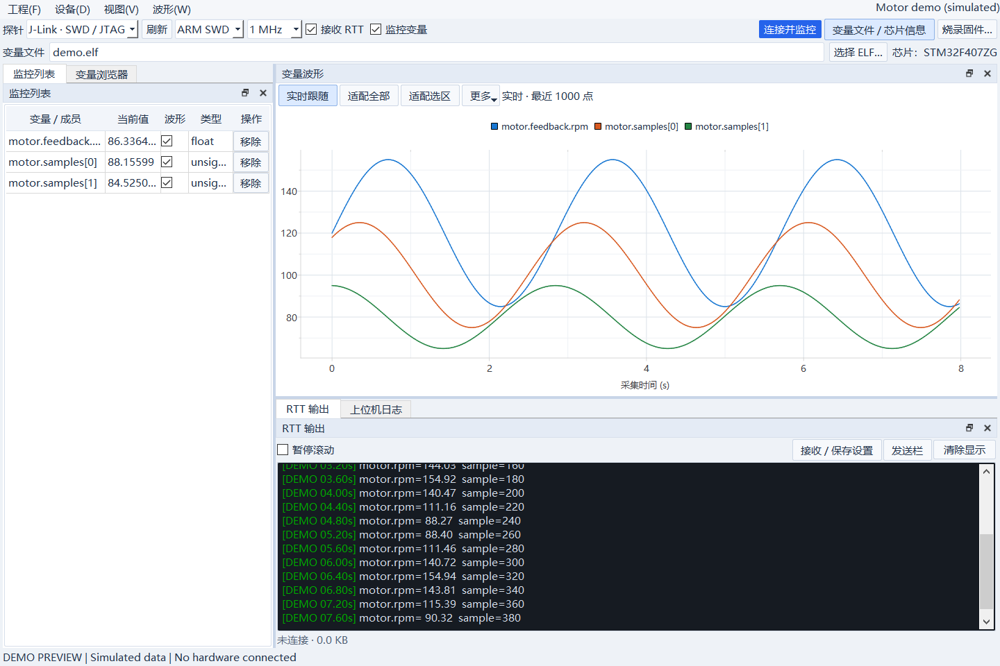
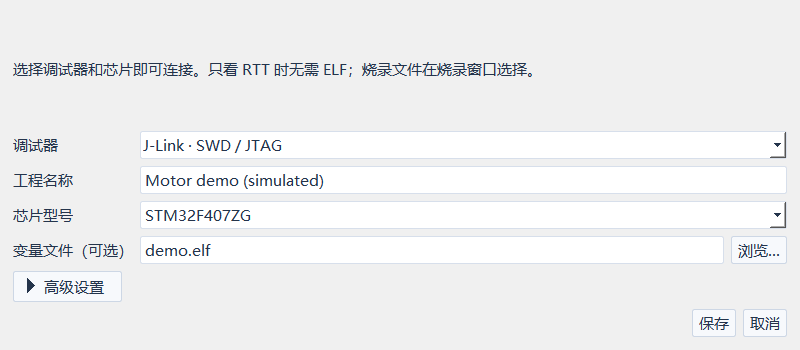

# MCU Desk: A Desktop Toolkit for Embedded Development

A desktop debugging toolkit for embedded development, featuring RTT logging,
variable monitoring, real-time plotting, and firmware flashing.

Based on [RTTView](https://github.com/XIVN1987/RTTView).

## Screenshots



*Application preview with simulated data; no hardware is connected. The current interface is in Chinese.*

<details>
<summary>Project settings</summary>



</details>

## Features

- RTT log streaming, color display, and recording
- Variable monitoring from ELF files, including structure members
- Real-time plots with zoom controls and CSV export
- Firmware flashing from HEX, ELF, and BIN files
- Saved project settings and window layouts

Projects use the `.mcudesk.json` extension. Existing `.rttview.json` projects
remain supported.

## Prerequisites

| Use case | Requirements |
|---|---|
| J-Link connection and standard flashing | Install the official SEGGER J-Link software and drivers |
| DAPLink connection | Install the appropriate USB driver |
| DAPLink flashing | Install OpenOCD and configure its executable path, interface, and target configuration files |
| RTT logging | The target firmware must include RTT and be running with RTT output enabled |
| Variable monitoring and plotting | Provide an ELF / AXF / OUT file with debug information that matches the firmware on the target |

Device support depends on the debug probe and backend tools.

## Quick Start

Use Python 3.11 and run from the repository root:

```powershell
py -3.11 -m venv .venv
.\.venv\Scripts\python.exe -m pip install -r requirements.txt
.\.venv\Scripts\python.exe main.py
```

`main.py` is the application entry point. For a Windows portable build, extract
the entire package and run `MCU-Desk.exe`; Python and Qt are included.

1. Connect the debug probe and power the target board.
2. Select the probe and chip under **Project → Project Settings** (`工程 → 工程设置`).
3. For variable monitoring, open **Variable File / Chip Info** (`变量文件 / 芯片信息`), select the ELF file, and add variables.
4. Click **Connect** (`连接`) to view logs, variables, and plots.

An ELF file is not required for RTT logging alone.

To program firmware, click **Flash Firmware** (`烧录固件`), select the file, and
verify the write address and erase settings. BIN files require an explicit write address.

## Build a Windows Portable Package

Requires Windows x64 and Python 3.11. Run from the repository root:

```powershell
powershell -NoProfile -ExecutionPolicy Bypass -File packaging/build.ps1
```

Output: `dist/MCU-Desk/MCU-Desk.exe`. Distribute the entire output directory
and provide corresponding source code and build instructions as required by the licenses.

## Reporting Issues

Include the application version, chip model, probe type, reproduction steps,
and relevant logs. Remove sensitive information before submitting an issue.

## Acknowledgments and License

Thanks to RTTView, pyOCD, PyQt / Qt, SEGGER RTT, and OpenOCD.

The project as a whole is licensed under the GNU General Public License v3.0.
Third-party code and components retain their respective copyrights and licenses.

See [LICENSE](LICENSE), [THIRD_PARTY_NOTICES.md](THIRD_PARTY_NOTICES.md),
and [LICENSES/](LICENSES/).

The J-Link DLL integration still requires a license compatibility review before
release; see the third-party notices above.
